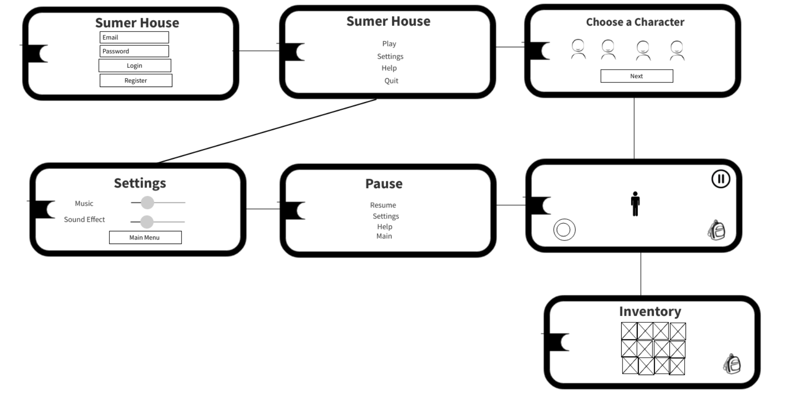

# *Sumer House*

### Table of Contents
1. [Description](#Description)
2. [Installation](#Installation-Proccess) 
3. [Product Spec](#Product-Specs)
4. [Wireframes](#Wireframes)
5. [Game Walkthrough](#Game-Walkthrough)
  

## Description 

*Sumer House* is a 2D puzzle game in the 32-bit style built on Unity. The goal of the game is to escape the room by solving puzzles. Users are able to register and login to our application to get access the game. The information is saved on a Firebase Database. 

### App Evaluation
The app *Sumer House* is evaluated across the following attributes.

- **Category:** Game
- **Mobile:** This app is developed for mobile use only. 
- **Market:** Any individual who needs to distract themselves and enjoy a simple puzzle game. 
- **Habit:** This app can be used at any time an individual wants to play. 
- **Scope:** There is a large potential for the app if we create more complex levels and add more attributes a score board which can create some competition between users. 

## Installation Proccess 

### Prerequisites 
Download Unity and Unity Editor Version 2020.3.26f [Unity Download Link](https://unity3d.com/get-unity/download/archive)

### Clone the repository
~~~
$ git clone https://github.com/SanCarlos25/UnityGame.git
~~~

## Product Specs 

### 1. User Stories (Required and Optional)
**Required Stories**
- [x]  User can log in or register into the app 
- [x]  Main Menu screen can access Play Screen and Settings Screen 
- [x]  In the Play Screen, the user can move around and move other objects.
- [x]  In the Settings Screen, the user can adjust the game volume. 
- [x]  In the Paused Screen, will allow access to the Settings Screen and allow user to return to Main Menu.  
- [x]  Player inventory will show the items collected during the game. 
 
**Optional Stories**

* Score Board Screen will show users who have the fastest time in completing a specific level.
* Help Screen will show users a tutorial on how to do basic movement 
* Checkpoints will help the user save the progress of the game and can return to a previous saved checkpoint 
* Characters will have dialog 

### 2. Screen Archetypes
* Login/Register 
* Main Menu
* Character Selection 
* Play Screen 
* Paused Screen 
* Settings 
* Inventory 

### 3. Navigation
**Flow Navigation** (Screen to Screen) 

* Login/Register -> Main Menu
* Main Menu -> Character Selection 
* Character Selection -> Play Screen 
* Play Screen -> Paused Screen 
* Play Screen -> Inventory 
* Play Screen -> Level Complete
* Paused Screen -> Settings
* Paused Screen -> Main Menu 
* Level Complete -> Play Screen (restart level)
* Level Complete -> Main Menu

## Wireframes 

## Game Walkthrough
<
[)](https://www.youtube.com/watch?v=bV6PEXOHkVc)

